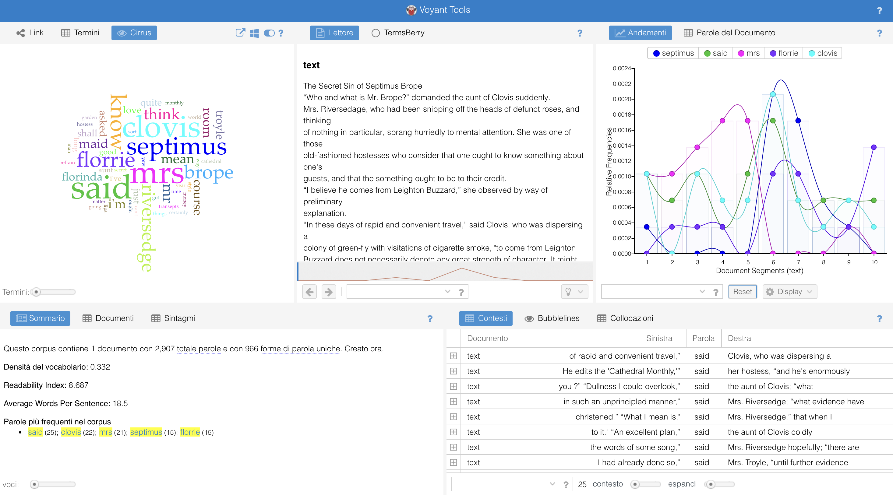

# Close Reading

### *The Secret Sin of Septimus Brope by Saki*

## Introduction

*The Secret Sin of Septimus Brope* written by Saki is a satirical short story about a respected ecclesiastical scholar who, due to the woman's social standing, appears to be involved in a socially inappropriate romantic intrigue. In the first half of the tale, accusations are leveled against Septimius, based on a series of overheard phrases and a misplaced note that suggest Brope is secretly courting Clovis's aunt's maid, Florinda. This apparent scandal is resolved when it is revealed that Brope's "love" is purely literary: he is struggling to compose a sentimental folk song, a secret activity that finances his respectable lifestyle.

This close reading examines how Saki employs irony, dialogue, and a late twist reveal to expose the hypocrisy and cultural anxieties of Edwardian society, in particular the tension between public respectability - what one appears to be - and the private reality that one tends to hide.

## Themes

The main themes found in the short story are the following:

* **Hypocrisy and double identity**: the dobule identity is embodied primarily by Septimus Brope, caught between his public role as respectable editor of the *Cathedral Monthly* and his secret activity as the author of frivolous love poems — the source of his financial support. However, the mechanism of hypocrisy is not exclusive to Brope: Clovis is also an integral part of it. While assuming the role of an ironic observer and unmasker, Clovis knowingly exploits Brope's secret to gain personal advantage, demonstrating that hypocrisy is not an individual exception, but a shared system.

* **False moralism and social control**: indeed, Mrs. Troyle's indignation — concerned with the alleged affair between her maid and the editor of the *Cathedral Monthly* — is not motivated by proven wrongdoing, but by suspicions and rumors. Furthermore, her concern is not Florinda's well-being at all, but the maintenance of social order and decorum. This reveals how moral authority in the story operates through anxiety rather than evidence.

* **High culture versus popular culture**: the short story also explores this theme, as Brope's academic work is socially appreciated and recognized, while his popular songs — despite their commercial success — are considered mediocre and shameful. The story not only contrasts high and popular culture, but also challenges the very idea that the cultural value of a work coincides with the level of intellectual competence of its creator. Brope's sentimental songs are considered silly and culturally inferior, yet they are written by someone with great cultural capital. Through this incongruity, Saki suggests that the devaluation of popular culture stems from a series of social prejudices.

## Narrative Voice and Perspective
The story is told by a third-person narrator who maintains an ironic distance and refrains from explicit moral judgments. Much of the narrative unfolds through dialogue, allowing the characters to indirectly reveal their values, without the external narrator having to discolose their opinion, but rather prompting the reader to form their own. Clovis serves as the focal figure of irony: insightful, manipulative, and amused by the moral rigidity of others. Through Clovis, the story undermines the authority of those who claim moral seriousness.

## Structure

As mentioned previously, the narrative structure is built around a misunderstanding, followed by delayed revelation. The first half of the story attempts to create a false scandal in which Brope is suspected of having courted a waitress. Various pieces of evidence support this hypothesis, such as overheard conversations and a lost note found on the floor. The turning point occurs when Clovis and Brope find themselves together in the smoking area and have a conversation, where the apparent moral transgression is revealed to actually be an artistic and commercial secret, and the affair with the waitress becomes merely the pretext that inspires Brope to write his songs. The final verse of the song dedicated to Florrie, in fact, provides a comic conclusion, subverting expectations and dissolving the original conflict.

## Key Passages

Several key passages shape the narrative and thematic development of *The Secret Sin of Septimus Brope*. 

* The phrase "I love you, Florrie", overheard by Clovis's aunt, serves as a narrative trigger, initiating the false scandal through its deliberate ambiguity and thus demonstrating how suspicion tends to be based on supposition rather than evidence. This misunderstanding is reinforced by the note lost by Brope and found by Mrs. Troyle, "Meet me in the garden by the yew", which is immediately interpreted as conclusive evidence of misconduct, revealing the willingness of do-gooders to turn private writings into incriminating evidence.

* The discussion of Brope's income introduces a structural contradiction between cultural prestige and economic reality, preparing the reader for the central revelation. This turning point occurs in the conversation between Clovis and Brope, where the alleged moral transgression is revealed to be not only artistic rather than sexual, but also necessary to maintain the high-class lifestyle he has adopted.

* The list of sentimental songs, such as “Cora with the lips of coral,” parodies popular culture and highlights the prejudice against popular creativity. Finally, the hostile refrain about Florrie provides comic closure by overturning the conventions of the love song and dissolving the initial moral panic.

# Distant Reading

## Quantitative Analysis of the Complete Story

### Introduction

In this section, [**Voyant Tools**](https://voyant-tools.org/?corpus=06ad4730677514c90d89d40478e1e3fe) is used to perform a distant reading of *The Secret Sin of Septimus Brope* without any divisions within the text. Given the brevity of the text and its coherent narrative structure, the analysis is conducted on a single document - instead of a corpus - as a first step. This was my personal choice, as the story does not present any divisions made by the author.

### Summary

Quantitative analysis conducted with Voyant Tools provides structural and objective support for the previous close reading of *The Secret Sin of Septimus Brope*. 
  The corpus consists of a single document of 2,907 tokens with 966 types, with a relatively high vocabulary density (0.332). This suggests a linguistically diverse text, consistent with its reliance on dialogue and satirical exchanges rather than repetitive narrative description. The readability index (8.687) and average sentence length (18.5 words) indicate an accessible yet sophisticated prose style, suited to irony and readable social commentary throughout the short story.
  The most frequent word in the corpus is "said" (25 occurrences), underlining the predominance of dialogue in the narrative. Among the characters' names, "Clovis" (22) appears more frequently than "Septimus" (15), confirming Clovis's role as the main narrative agent and manipulator of events. It's also worth remembering that the story is part of the book
*The Chronicles of Clovis*, in which Clovis is the protagonist. Despite this, it should be noted that voyant tools does not look at the character's space, which probably occupies more sections than those in which only the proper name appears, so this is not a data that should be relied upon.
  The high frequency of "Mrs" (21) reflects the strong presence of figures representing social control and moral surveillance – one of the novella's predominant themes. In particular, "Florrie" (15) is one of the most frequent terms despite the character never speaking directly, and this underlines her function as a symbolic figure – rather than an active integral part of the story – around which misunderstandings, suspicions, and satire revolve. The appearance of both “Florrie” and “Florinda” (7) further underlines the gap between the imagined figure and the actual maid, reinforcing the theme of misinterpretation.
  Abstract verbs such as “know” (12), “think” (9), and modal verbs like “shall” (6) point to the narrative’s preoccupation with judgment, intention, and control rather than action. Finally, the relatively low frequency of “love” (6), despite its apparent thematic importance, supports the interpretation that love in the story is not an authentic emotion but a mechanical and formulaic element associated with popular song lyrics.
  Overall, Voyant Tools — along with close reading — reveals how the story’s lexical emphasis mirrors its thematic concerns: discourse over action, social judgment over evidence, and the ironic centrality of a character who exists primarily through speech rather than presence.

### Trends

The trends of key terms such as “said”, “Septimus”, and “Florrie” remain relatively stable across the entire text, indicating a consistent narrative focus rather than a sharp structural rupture. The steady frequency of “said” confirms that dialogue functions as a constant narrative framework throughout the story. Similarly, the regular presence of “Septimus” suggests that, although his role evolves thematically, he remains central to the narrative from beginning to end. The stable occurrence of “Florrie” across the text indicates her consistent thematic importance; however, a closer examination of the passages in which she appears reveals that she never speaks directly. Despite being a central figure in the narrative, Florrie lacks narrative autonomy and functions primarily as an object of discourse rather than as an active agent, reinforcing her role as a linguistic and symbolic construct shaped entirely by others' interpretations.

## Comparative Distant Reading of The Corpus

### Introduction 

To explore structural differences within the narrative, the text was divided into two corpora corresponding to its main narrative phases and re-entered into [**Voyant Tools**](https://voyant-tools.org/?corpus=64d6800297bc555c4fa772c9fb6176d9). The first part centres on suspicion, social judgment, and the construction of a moral scandal, while the second part contains the revelation of Brope’s “secret sin” and its satirical resolution. This division reflects a clear shift in narrative function rather than an arbitrary segmentation.

### Summary

Both sections are similar in length (1,458 and 1,449 words respectively), allowing for meaningful comparison. The second part shows a slightly higher vocabulary density (0.416 vs. 0.398), suggesting greater lexical variety. This increase corresponds to the introduction of new semantic fields related to artistic production and commerce, as well as to the insertion of parody lyrics. The slightly higher readability index in the second section (8.844 vs. 8.532) reflects a move from socially regulated dialogue to more playful and ironic exchanges.

The list of characteristic words further highlights the thematic contrast between the two sections. In the first part, terms such as “maid,” “hostess,” “ought,” and “Troyle” dominate, reinforcing the focus on domestic space, social hierarchy, and moral prescription. By contrast, the second part is characterised by words such as “money,” “rhyme,” “lorry,” and “knew,” which signal a shift towards economic concerns, creative process, and knowledge. This lexical transition mirrors the narrative reversal of the story, in which moral anxiety gives way to a critique of cultural value and artistic respectability.

Thus, the distant reading confirms that the story is structured around a sharp semantic and thematic divide: from social surveillance and suspicion to revelation and satire. Quantitative patterns thus support the close reading by visualising the text’s deliberate movement from moral panic to comic demystification.

### Trends

The Trends tool further highlights the narrative shift between the two sections of the text. In the first part, terms such as “mrs” and “septimus” show a significantly higher relative frequency, reflecting the dominance of social authority, moral judgment, and suspicion directed at Brope. Septimus appears primarily as an object of discourse rather than as an active voice, reinforcing his passive role within the moral panic constructed by others.
  In the second part, the frequency of “clovis” and “florrie” increases markedly. This shift corresponds to Clovis’s growing narrative control and to the transformation of Florrie from a presumed romantic figure into a literary and artistic construct. At the same time, the decline of “love” in the second section supports the interpretation that sentimental language loses its apparent emotional weight once its mechanical and commercial nature is revealed. The consistently high frequency of “said” across both sections confirms that dialogue remains the primary narrative engine, while the relative stability of “know” reflects the text’s ongoing concern with interpretation, knowledge, and misinterpretation.
  Overall, the distribution of these terms visualises the story’s movement from moral surveillance to satirical disclosure, reinforcing the close reading through quantitative evidence.

## Conclusion 

The combination of close reading and distance reading allows for a more complete interpretation of *The Secret Sin of Septimus Brope*. Through close reading, the analysis highlighted the central themes of hypocrisy, double identity, and cultural hierarchy, showing how the narrative constructs a moral scandal that is then dismantled through satire, present throughout the novella. Attention to dialogue, character function, and key passages reveals how suspicion is generated by fragments of dialogue and social assumptions rather than concrete evidence.
  Distance reading conducted with Voyant Tools complements these findings by providing quantitative support for the qualitative interpretation. Analyzing the full text as a single document, lexical trends confirm the ongoing importance of dialogue and the stable presence of key figures such as Septimus and Florrie, while also revealing their varying degrees of narrative agency.
  Furthermore, dividing the text into two sections allowed us to visualize the narrative shift from moral surveillance to satirical revelation. The contrasting distribution of character names and thematic terms in the two parts reflects the shift from suspicion and social authority to revelation through the plot twist.
  In conclusion, this integrated approach demonstrates that digital tools like Voyant are most effective when used in dialogue with traditional literary analysis. While numerical models cannot replace interpretation, they can make underlying textual dynamics visible and support critical claims more objectively, ultimately enriching rather than simplifying the reading of the text.

