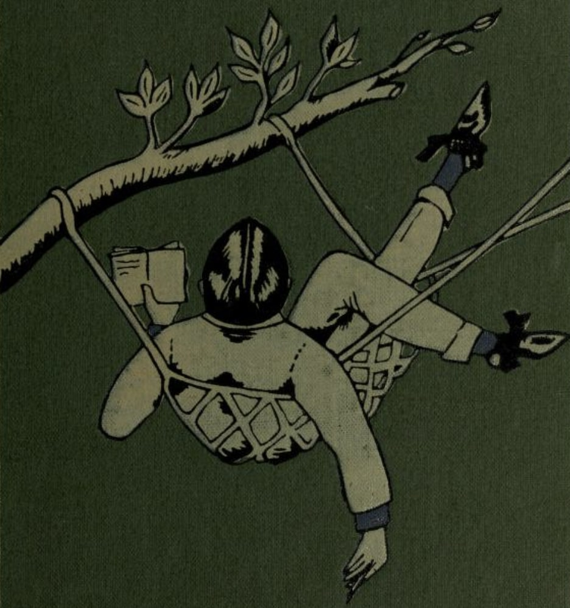

# Close Reading

### *The Secret Sin of Septimus Brope by Saki*

## Introduction

*The Secret Sin of Septimus Brope* written by Saki is a satirical short story about a respected ecclesiastical scholar who, due to the woman's social standing, appears to be involved in a socially inappropriate romantic intrigue. In the first half of the tale, accusations are leveled against Septimius, based on a series of overheard phrases and a misplaced note that suggest Brope is secretly courting Clovis's aunt's maid, Florinda. This apparent scandal is resolved when it is revealed that Brope's "love" is purely literary: he is struggling to compose a sentimental folk song, a secret activity that finances his respectable lifestyle.

This close reading examines how Saki employs irony, dialogue, and a late twist reveal to expose the hypocrisy and cultural anxieties of Edwardian society, in particular the tension between public respectability - what one appears to be - and the private reality that one tends to hide.

## Themes

The main themes found in the short story are the following:

* **Hypocrisy and double identity**: the dobule identity is embodied primarily by Septimus Brope, caught between his public role as respectable editor of the *Cathedral Monthly* and his secret activity as the author of frivolous love poems — the source of his financial support. However, the mechanism of hypocrisy is not exclusive to Brope: Clovis is also an integral part of it. While assuming the role of an ironic observer and unmasker, Clovis knowingly exploits Brope's secret to gain personal advantage, demonstrating that hypocrisy is not an individual exception, but a shared system.

* **False moralism and social control**: indeed, Mrs. Troyle's indignation — concerned with the alleged affair between her maid and the editor of the *Cathedral Monthly* — is not motivated by proven wrongdoing, but by suspicions and rumors. Furthermore, her concern is not Florinda's well-being at all, but the maintenance of social order and decorum. This reveals how moral authority in the story operates through anxiety rather than evidence.

* **High culture versus popular culture**: the short story also explores this theme, as Brope's academic work is socially appreciated and recognized, while his popular songs — despite their commercial success — are considered mediocre and shameful. The story not only contrasts high and popular culture, but also challenges the very idea that the cultural value of a work coincides with the level of intellectual competence of its creator. Brope's sentimental songs are considered silly and culturally inferior, yet they are written by someone with great cultural capital. Through this incongruity, Saki suggests that the devaluation of popular culture stems from a series of social prejudices.

## Narrative Voice and Perspective
The story is told by a third-person narrator who maintains an ironic distance and refrains from explicit moral judgments. Much of the narrative unfolds through dialogue, allowing the characters to indirectly reveal their values, without the external narrator having to discolose their opinion, but rather prompting the reader to form their own. Clovis serves as the focal figure of irony: insightful, manipulative, and amused by the moral rigidity of others. Through Clovis, the story undermines the authority of those who claim moral seriousness.

## Structure

As mentioned previously, the narrative structure is built around a misunderstanding, followed by delayed revelation. The first half of the story attempts to create a false scandal in which Brope is suspected of having courted a waitress. Various pieces of evidence support this hypothesis, such as overheard conversations and a lost note found on the floor. The turning point occurs when Clovis and Brope find themselves together in the smoking area and have a conversation, where the apparent moral transgression is revealed to actually be an artistic and commercial secret, and the affair with the waitress becomes merely the pretext that inspires Brope to write his songs. The final verse of the song dedicated to Florrie, in fact, provides a comic conclusion, subverting expectations and dissolving the original conflict.

## Key Passages

Several key passages shape the narrative and thematic development of *The Secret Sin of Septimus Brope*. 

* The phrase "I love you, Florrie", overheard by Clovis's aunt, serves as a narrative trigger, initiating the false scandal through its deliberate ambiguity and thus demonstrating how suspicion tends to be based on supposition rather than evidence. This misunderstanding is reinforced by the note lost by Brope and found by Mrs. Troyle, "Meet me in the garden by the yew", which is immediately interpreted as conclusive evidence of misconduct, revealing the willingness of do-gooders to turn private writings into incriminating evidence.

* The discussion of Brope's income introduces a structural contradiction between cultural prestige and economic reality, preparing the reader for the central revelation. This turning point occurs in the conversation between Clovis and Brope, where the alleged moral transgression is revealed to be not only artistic rather than sexual, but also necessary to maintain the high-class lifestyle he has adopted.

* The list of sentimental songs, such as “Cora with the lips of coral,” parodies popular culture and highlights the prejudice against popular creativity. Finally, the hostile refrain about Florrie provides comic closure by overturning the conventions of the love song and dissolving the initial moral panic.

